# Majesty Tours — Website & Admin User Guide

This guide explains how the Majesty Tours website works for visitors, how to manage its content as an admin, and exactly where every piece of data lives. It's written for whoever ends up running the day-to-day content on this site — no coding required for the admin sections.

> 🔒 **A note on passwords:** nowhere in this guide are real credentials shown. Every login field is illustrated with placeholder text (`you@example.com`, `••••••••`). Your actual login is created and managed in Netlify's dashboard — see [Admin Guide → Logging in](#logging-in).

---

## Contents

1. [What this site is](#what-this-site-is)
2. [Visiting the site (public experience)](#visiting-the-site-public-experience)
3. [Where your data actually lives](#where-your-data-actually-lives)
4. [Admin Guide — managing content](#admin-guide--managing-content)
5. [Where form submissions go](#where-form-submissions-go)
6. [FAQ](#faq)

---

## What this site is

Majesty Tours' site is a **static website** — plain HTML, CSS and JavaScript with no server-side app and no database. There's a small content-editing tool (an "admin" area) bolted on top of it so someone non-technical can update prices, tour text, and photos without touching code.

| Piece | What it does |
|---|---|
| The website (`index.html` + supporting pages) | What visitors see — journeys, gallery, fleet, contact form |
| The admin area (`/admin`) | A content editor ("Decap CMS") for the two files that drive the site's text and photos |
| Netlify | Hosts the site and rebuilds it automatically whenever content changes |
| Google Sheets | Where inquiry-form and partner-registration submissions land |

There are **no customer accounts** — visitors don't log in or create passwords anywhere on the public site. The only login on the whole site is the admin login for editing content.

---

## Visiting the site (public experience)

### Homepage

The homepage is one long scrolling page (a "single-page site") with a sticky nav bar linking to each section: **Journeys, Day Trips, The Island, When to go, Gallery, Fleet**, plus a **Plan a journey** button that jumps to the contact form.

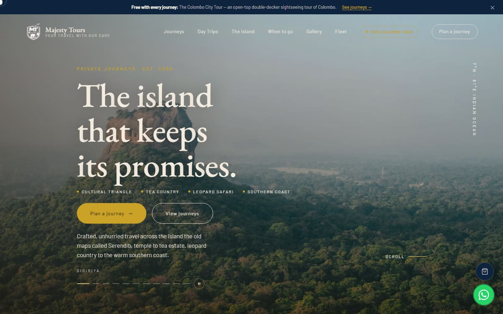

Just below the hero, a short trust/intro section sets expectations before visitors reach the tours themselves.

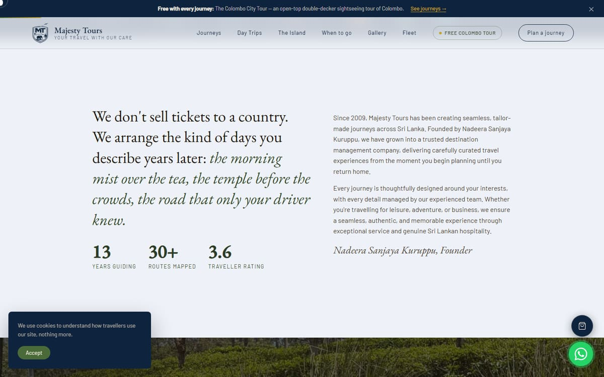

### Journeys (tours)

Each of the 7 signature tours is listed with its route, price, and duration. Clicking the **+** button next to a tour adds it to the visitor's inquiry cart (see below); clicking the tour name itself expands its full day-by-day itinerary, photos, and highlights inline.

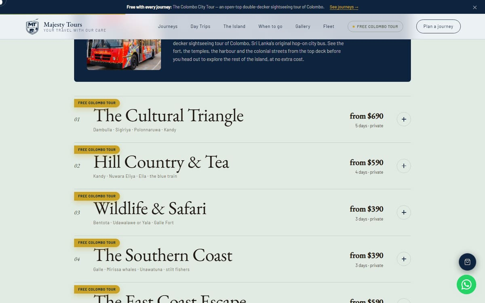

### Day Trips & add-ons

Shorter add-ons (airport transfers, whale watching, cooking classes, etc.) that a visitor can tack onto any journey — same "+ to add" mechanic as the tours above.

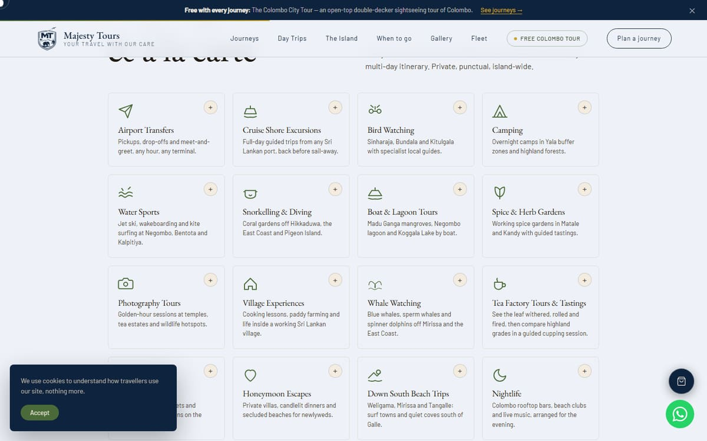

### The Island (interactive map)

A clickable map of Sri Lanka — selecting a journey on the left highlights its route and stops on the map.

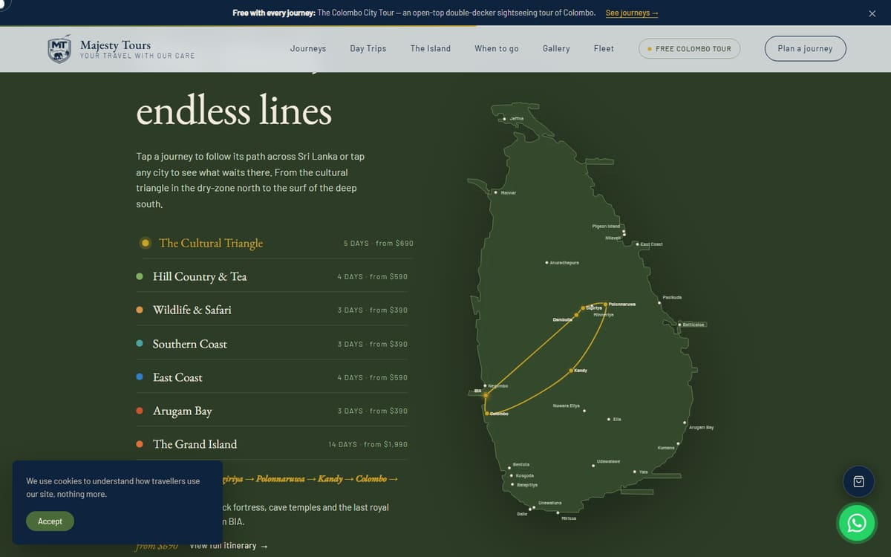

### When to go

A month picker that recommends which journeys suit the season selected — useful for visitors unsure when to travel.

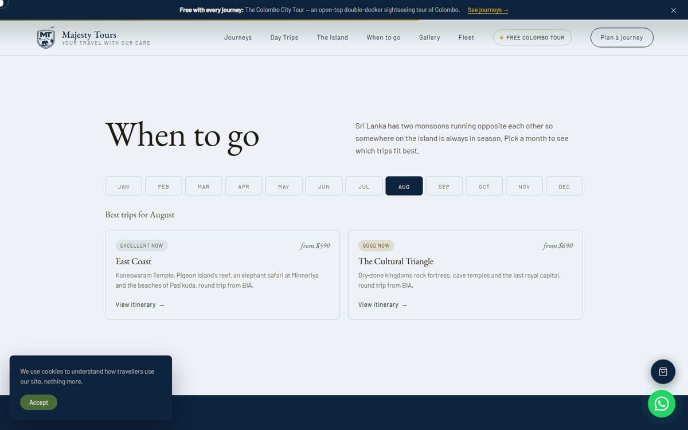

### Gallery

A photo/video grid pulled from the gallery the admin manages in the CMS (see [Admin Guide](#gallery-photos)).

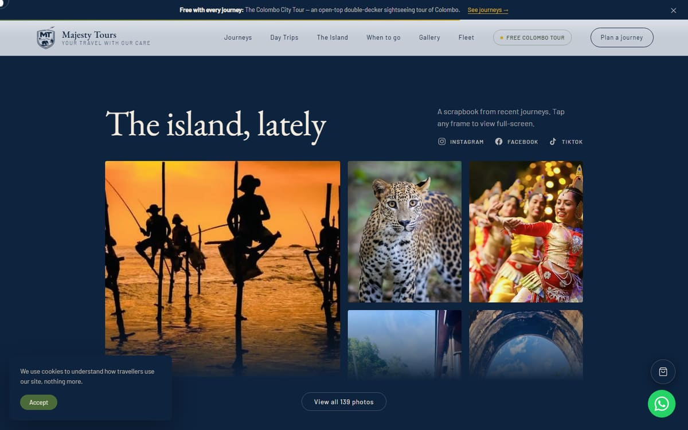

### Fleet

The vehicle types available (sedan, SUV, vans, mini-coach, coach), each with its own photo set.

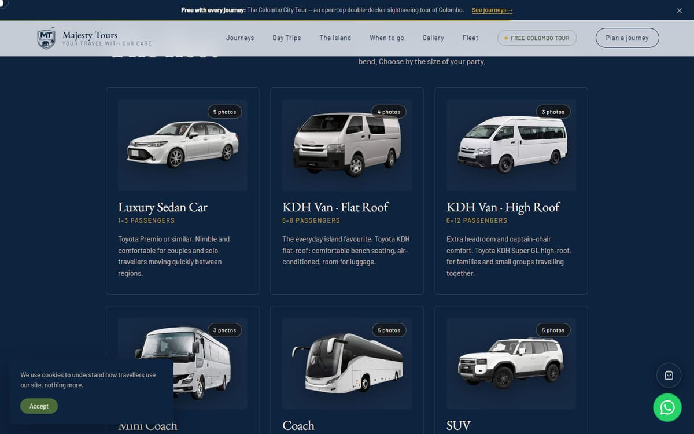

### Planning a journey (the "cart" and inquiry form)

This is **not a shopping cart with checkout** — there's no payment on the site. It's a simple way for a visitor to build a shortlist of journeys/add-ons before sending an inquiry:

1. Visitor clicks **+** on any journey or add-on anywhere on the page.
2. The item appears in the **"Your selection"** panel inside the contact form, and in a small floating cart bubble in the corner of the screen.
3. The visitor fills in their name, phone, and email and submits — their selection is sent along with the message.

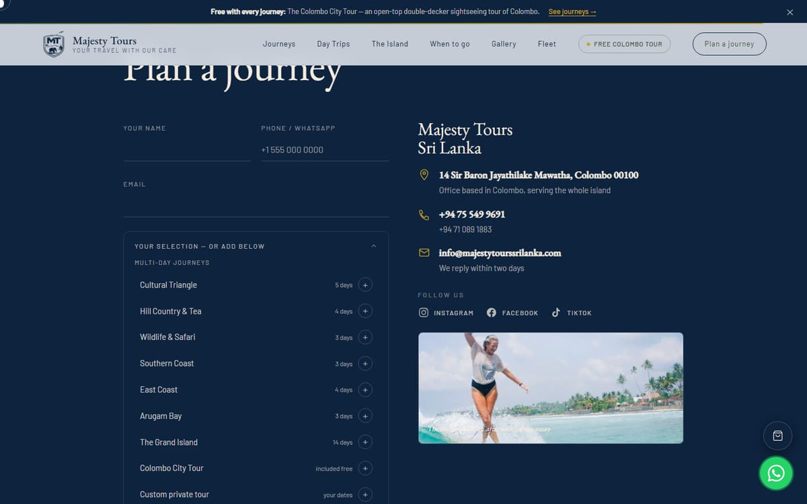

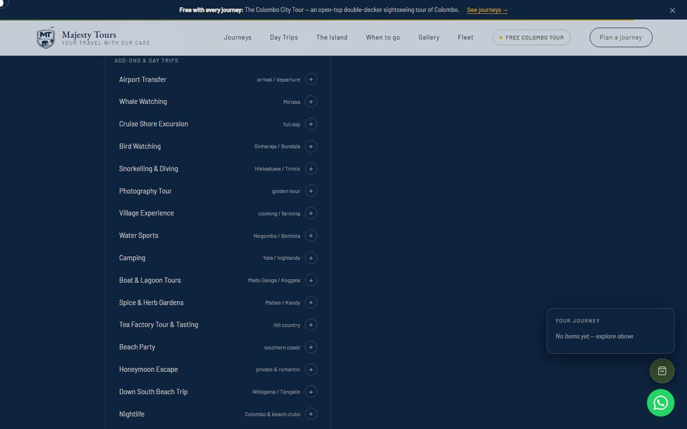

This selection is stored only in the visitor's own browser (see [Where your data lives](#the-cart-selection)) — it's never seen by anyone until they actually submit the form.

### Footer & legal pages

The footer links to **Privacy**, **Terms**, **Cancellation Policy**, and **Partner Registration**, plus the review-platform and social links the admin manages in the CMS.

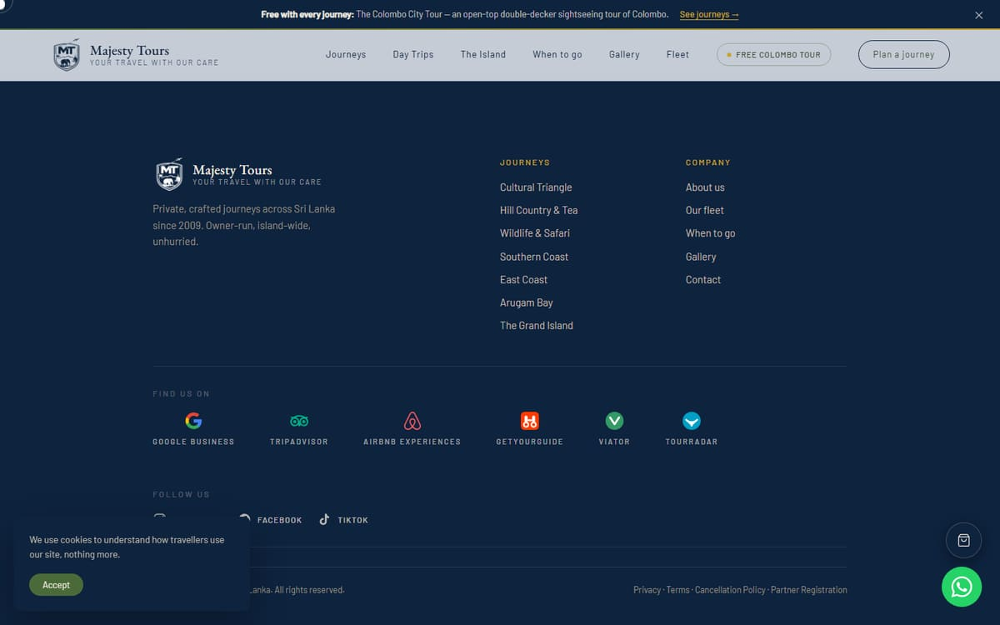

Legal pages (Privacy shown here) are plain static pages sharing the same styling:

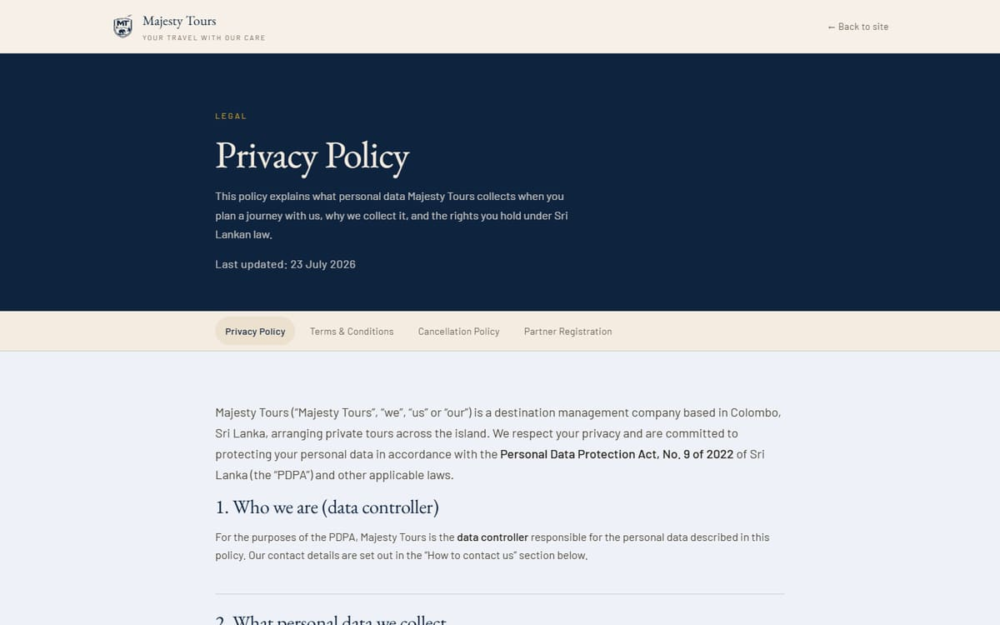

### Partner Registration

A separate page (`register.html`) for drivers, chauffeur guides, and national guides to apply to work with Majesty Tours. It collects their details and licence/vehicle documents and assigns a Partner ID immediately on submission.

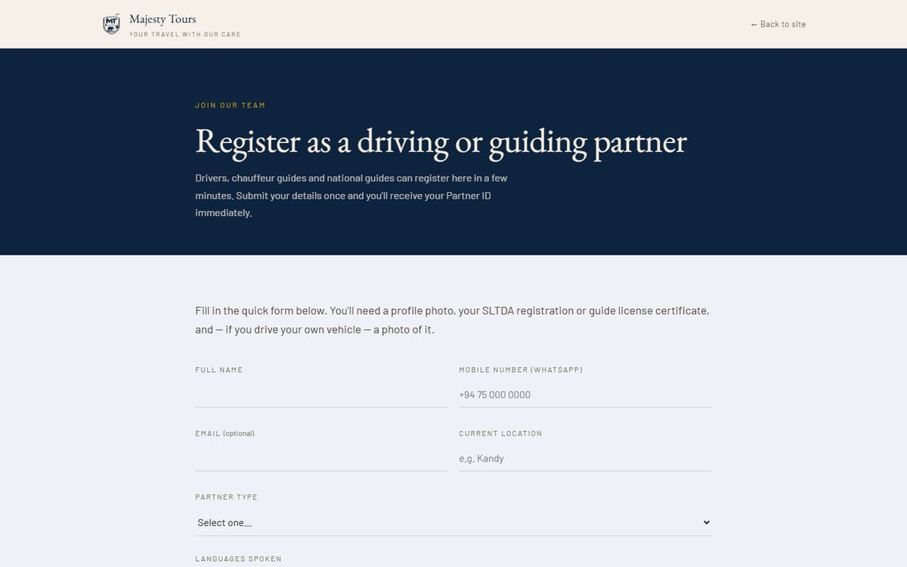

---

## Where your data actually lives

This is the part most guides skip — here's exactly where everything is stored, so you always know where to look.

| Data | Lives in | Edited via | Notes |
|---|---|---|---|
| Contact details, social/platform links, stats, and all 7 tours' text | `content.json` (in the website's code repository) | Admin → **Contact & Info** | Plain text file, not a database |
| Gallery photos & videos | `gallery.json` (in the repository) | Admin → **Gallery Photos** | Freely add/remove items here |
| The actual photo/video files | the `assets/` folder (in the repository) | Uploaded through the CMS's **Media Library** | Served directly as static files |
| Inquiry form submissions ("Plan a journey") | A **Google Sheet**, via a Google Apps Script web link | — (read-only, visitors just submit) | Not visible anywhere in the CMS |
| Partner registration submissions | A **separate Google Sheet**, via its own Google Apps Script link | — | Also not in the CMS |
| The visitor's cart/selection | The visitor's own browser (`localStorage`) | — | Cleared if they clear browsing data; never sent anywhere until they submit the form |
| Admin login accounts | Netlify's own dashboard (Identity) | Netlify dashboard, not the CMS | See [Logging in](#logging-in) |

**In plain terms:** there is no traditional database behind this site. The website's own text and photos live as two files that a save in the admin tool updates directly; everything a visitor submits (inquiries, partner applications) goes straight to Google Sheets instead of anywhere on the website itself.

### How a content edit reaches the live site

```
Admin edits in /admin  →  saved to content.json / gallery.json  →  site rebuilds automatically  →  live within a minute or two
```

There is no separate "publish" step to remember beyond saving/publishing inside the CMS itself — once you save an entry there, it goes live on its own shortly after.

### The cart selection

The "Your selection" cart is intentionally lightweight: it lives only in that one visitor's browser for as long as they keep it, and is bundled into the inquiry email/sheet row only at the moment they submit the contact form. It never touches a server before that.

---

## Admin Guide — managing content

### Logging in

The content editor lives at:

```
https://<your-site-domain>/admin/
```

It's built on **Decap CMS** and protected by **Netlify Identity** — the same login system Netlify uses for its own dashboard. New admin users are invited from the **Netlify dashboard → Identity tab** on the site's Netlify project (not from anywhere on the website itself).

When you visit `/admin/`, you'll see a sign-in screen:


> The screenshot above is this site's local preview login, which just shows a "Login" button — on the real, live site this is replaced by Netlify's own popup asking for your **email** and **password**, illustrated below with placeholders only:

<table>
<tr><td>

**Sign in**

Email
`you@example.com`

Password
`••••••••`

**[ Log in ]**

</td></tr>
</table>

Forgotten your password? Use "Forgot password" inside that same Netlify Identity popup — it emails a reset link to the address your account was invited with.

### The Content screen

Once logged in, you land on **Contents**, with one collection called **Website Content**, containing two editable entries:

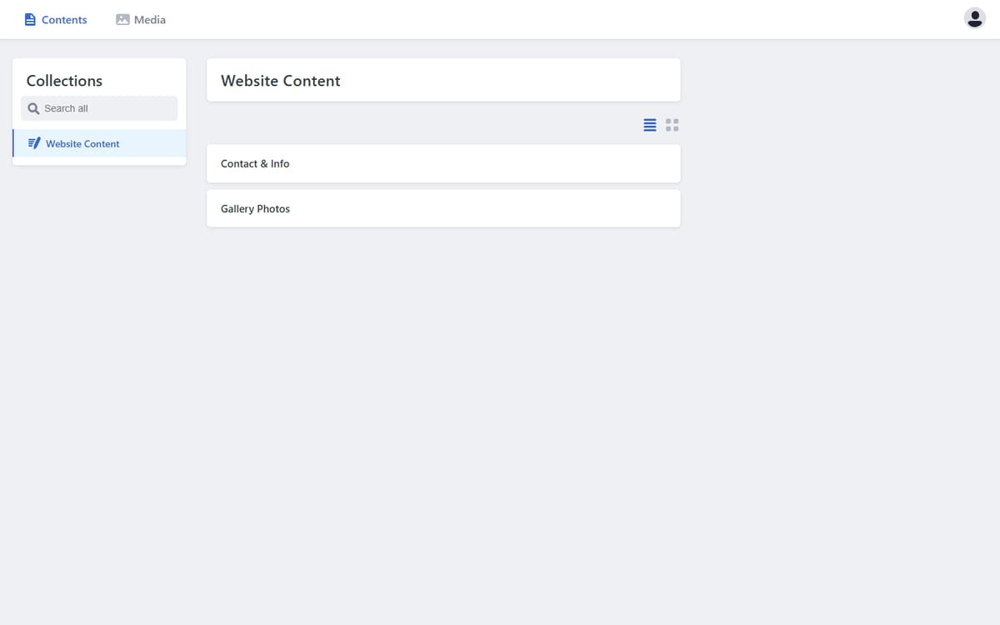

- **Contact & Info** → everything in `content.json`: contact details, review-platform links, social links, homepage stats, and the 7 tours.
- **Gallery Photos** → everything in `gallery.json`: the photo/video grid.

### Contact & Info

Opening this entry shows, from top to bottom: **Contact Details**, **Platform Links** (Google/TripAdvisor/Airbnb/GetYourGuide/Viator/TourRadar), **Social Media Links** (Instagram/Facebook/TikTok), **Stats** (years guiding, routes mapped, traveller rating), and finally **Tours**.

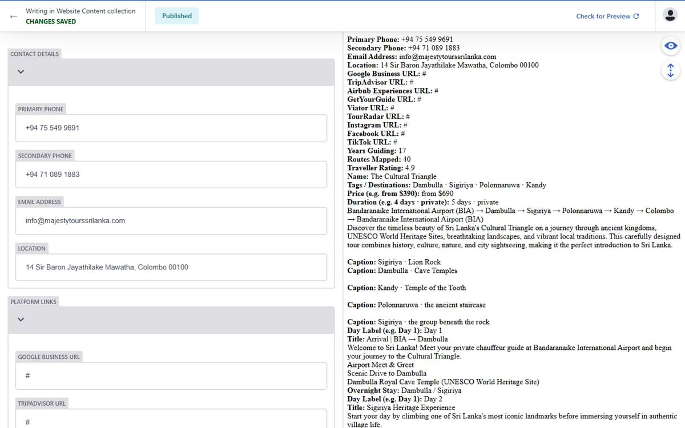

A live preview of exactly how each field renders on the site appears alongside the form as you type (visible on the right in the screenshot above) — a good way to sanity-check wording before saving.

#### Tours — what you can and can't change

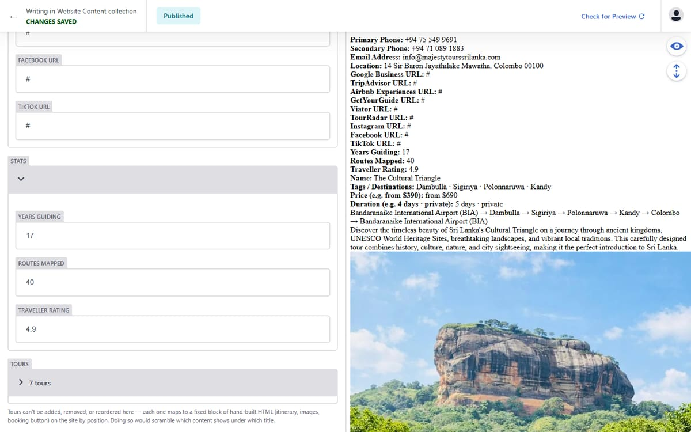

Each of the 7 tours has editable fields for: name, tags/destinations, price, duration, overview, slideshow images + captions, the full day-by-day itinerary (with highlights and, for days with a choice like "Udawalawe or Yala", alternate options), tour highlight chips, inclusions, themes, quick facts, destinations covered, and a "why choose this tour" blurb.

**You cannot add, remove, or reorder tours or slideshow photos here** — each tour and each slide maps to a fixed, hand-built block of HTML on the live page by its position in the list. Adding a new slot wouldn't create a matching spot on the site, and removing one would leave a broken slide behind. Reordering slideshow photos (not the tours themselves) is safe; everything else in a tour's fields is safe to edit freely.

### Gallery Photos

Unlike Tours, the gallery list is fully open — add or remove as many photo or video entries as you like. Each item is either:
- a **photo**: set the *Photo* field, leave *Video*/*Poster* blank, and
- a **video**: set *Video* (an `.mp4` file) **and** *Video Poster* (the thumbnail shown before it plays), leave *Photo* blank.

Every item needs a **Caption**.

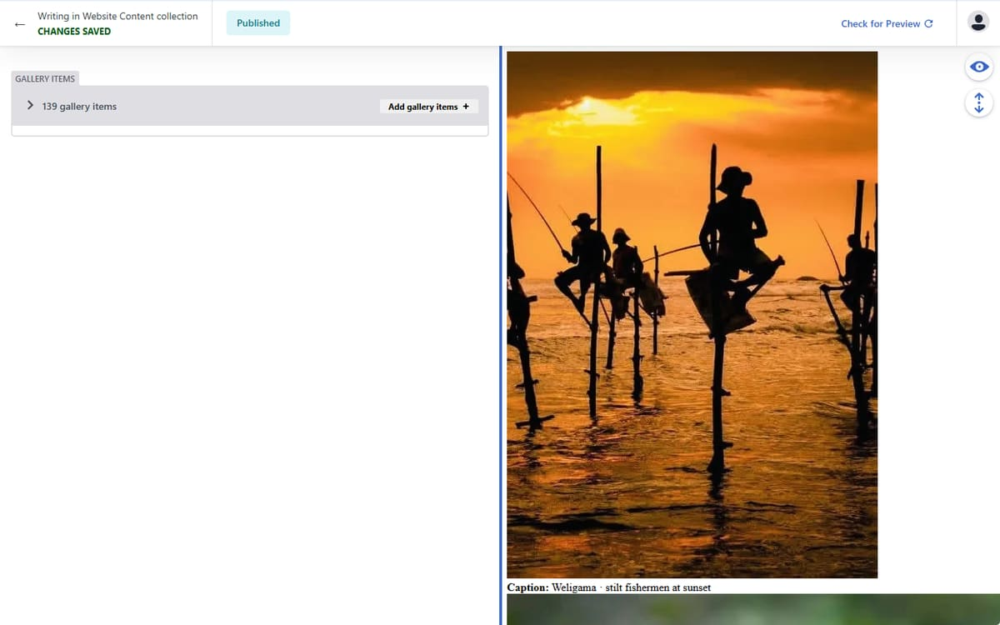

### Uploading photos & videos (Media Library)

Any time you click an image or file field (like *Photo*, *Video Poster*, or a slideshow image), the **Media Library** opens — this is the `assets/` folder shown as a searchable grid. Click **Upload** to add a new file from your computer, or pick an existing one already uploaded.

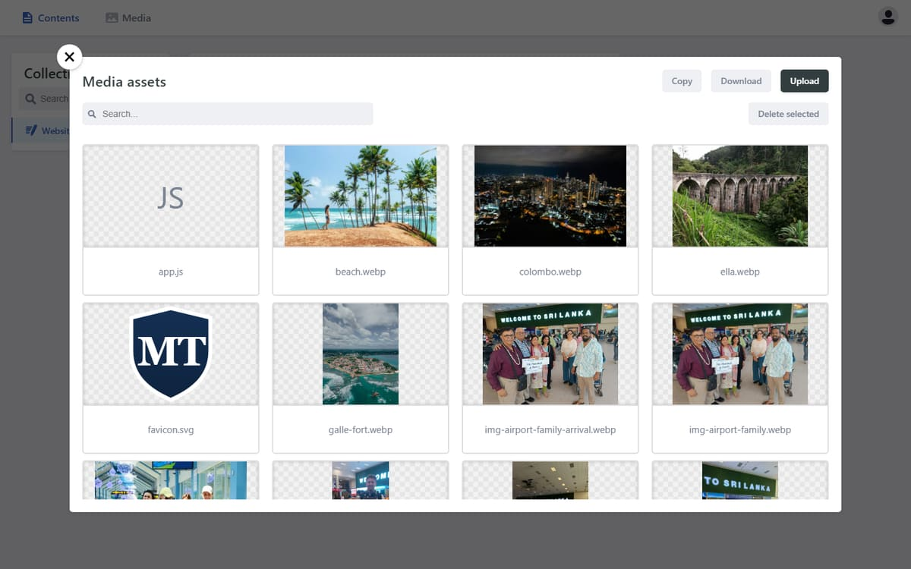

Uploaded files land in `assets/` and become available to reference from any image/file field across the site.

### Saving & publishing

Decap CMS auto-saves your in-progress edits as a draft as you type. When you're done, use the **Publish** control to commit your changes — that's the point they actually go live (see [How a content edit reaches the live site](#how-a-content-edit-reaches-the-live-site)). Give it a minute or two after publishing before checking the live site.

---

## Where form submissions go

Neither of the site's two forms is stored in the CMS or anywhere on the website — both post straight to **Google Sheets** through a Google Apps Script link:

- **"Plan a journey" inquiry form** (homepage) → its own Google Sheet, one row per inquiry, cart selection included.
- **Partner Registration form** (`register.html`) → a separate Google Sheet, one row per applicant, with their generated Partner ID.

If you need access to either sheet, ask whoever set up the Google Apps Script integration for edit access — it isn't something the CMS login grants.

---

## FAQ

**Q: I edited a tour's price in the CMS but the cart still shows the old price — is that a bug?**
No — this used to happen but was fixed. As long as you save/publish the edit, the cart and inquiry form now stay in sync with whatever the CMS shows.

**Q: Can I reorder the tours themselves (e.g. move "Wildlife & Safari" above "Hill Country & Tea")?**
No — reordering tours (or adding/removing them) isn't possible from the CMS, because each tour is tied to a specific hand-built block on the page. That would need a code change from your developer.

**Q: Where do I see who filled out the contact form or applied as a partner?**
In Google Sheets, not on the website — see [Where form submissions go](#where-form-submissions-go).

**Q: I forgot my admin password.**
Use "Forgot password" on the Netlify Identity login popup at `/admin/`. If you don't have an account yet, someone with access to the Netlify project's Identity tab needs to invite you.

**Q: Do visitors ever create an account or log in?**
No. Browsing, the tour cart, and the inquiry/registration forms are all account-free. The only login on the entire site is the admin one.
